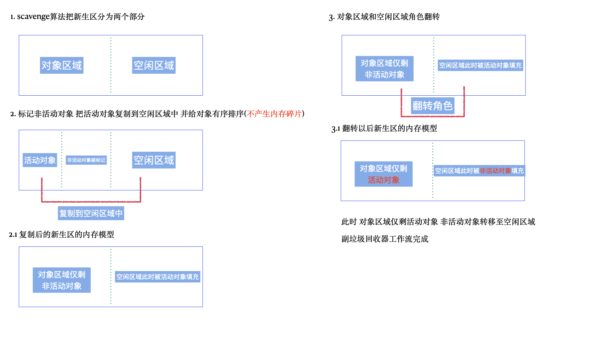

# V8垃圾回收机制
<!--
 * @Descripttion: 注释
 * @Author: 朱海华
 * @Date: 2020-05-14 08:39:00
 * @LastEditTime: 2020-05-15 08:15:15
 -->
## 开始前的名词解释环节

  ### 代际假说和分代收集
  
  * 首先明确一点 ```代际假说```是一个非常关键的概念 它是垃圾回收策略的相关基础
  
  * ```代际假说```有两个特点
    * 1. 大部分对象在内存中的存活时间非常短 简单来说就是 对象一经内存分配 很快就会无法访问
    
    * 2. 可以持续访问的对象(不死的对象) 存活时间较长

  口头描述是不是感觉比较生涩难以理解 但是没关系 我们先记住这两个特点 并且我们基于这两个特点 来一起看看 V8是如何实现垃圾回收机制的
  
  * ```新生代``` 和 ```老生代```
  
    * 1. 新生代 用于存放在内存中存活时间比较短的对象

    * 2. 老生代 用于存放在内存中存活时间比较长的对象

    * 3. 同时 V8基于```新生代``` 对应一个```副垃圾回收器``` 而```老生代```对应一个```主垃圾回收器```
  
  * 垃圾回收的执行流程
    * 不论主垃圾回收器还是副垃圾回收器 他们都有一个```统一的执行过程```

    * 1. 标记```活动对象```和```非活动对象```  前者的名词解释其实就是 ```还在使用的对象``` 后者的名词解释就是 ```可以进行垃圾回收的对象```

    * 2. 对于```非活动对象```所占据对内存 进行一次回收 (垃圾清理)

    * 3. 内存整理 我们都知道内存是一块```连续的分配空间``` 当多次进行垃圾回收以后 这块连续的内存空间会被变得不连续 那么就会产生```内存碎片``` 不过这一步并不是必须的 同时在上文提到的```副垃圾回收器```并不会产生内存碎片

  * 有了上述的名词解释基础以后 我们一起来看看副垃圾回收器是如何工作的吧

  ### 副垃圾回收器工作流(scavenge算法)
  
  * 基于```scavenge算法``` 副垃圾回收器把新生区对半分为了 ```对象空间```和```空闲空间``` 而所有的新对象都会被添加到```对象空间```里 同时 当对象空间快被```填满```的时候就会触发垃圾回收的前置条件

  * ### 回收过程
  
    * 1. 标记活动对象和非活动对象

    * 2. ```活动对象```复制到空闲区域中 同时```有序排列```所有的存活对象 这里的有序排列正好解释了为什么副垃圾回收器不会产生```内存碎片```  
    (```一块连续的内存空间被分割以后就会产生内存碎片 而副垃圾回收器在复制完活动对象以后 对所有的对象进行了一次排序 那么内存会重新归于连续状态```)

    * 3. 对```空闲区域```和```对象区域```做一次角色翻转 也就是两者角色兑换 也正是因为这个机制 在新生区中 这两个区域可以```无限次使用``` 脑补一下翻转过程 翻转以后此时的```空闲区域```被```非活动对象填充``` ```对象区域```仅剩下```活动对象``` 所以 也就完成了垃圾回收

    * 4. 翻转以后即完成垃圾回收

    具体的回收过程 可以参考下图
    