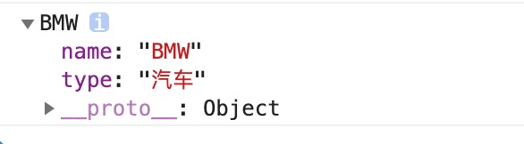
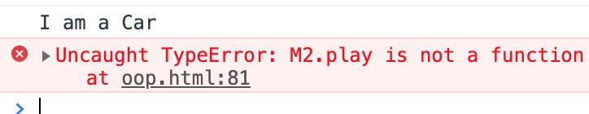
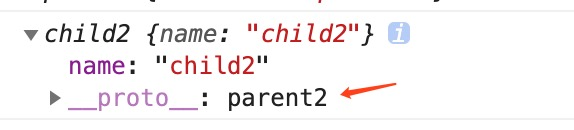

# JavaScript 之面向对象

## 前言

众所周知 JavaScript 万物皆可对象 这一篇博客 就来讲讲 JS 中面向对象的那些事儿 既然要面向对象 那么首先要想到的第一件事就是 `类` 没有这些类 哪儿来的对象是不是 所以 先来看看创建类的方式吧

## 类的声明方式以及实例化

类的创建方式有两种 一种就是`构造函数` 另一种就是 ES6 新推出的`class` 不过 class 其实也是通过构造函数去新建一个类 其实个人感觉两者大同小异吧 下面来看代码

```js
// ES5 构造函数创建类
function Car(name) {
  this.name = name
}
```

```js
// ES6 通过class新建一个类
class Plane {
  constructor(name) {
    this.name = name
  }
}
```

```js
// 通过类实例化一个对象
console.log(new Car('BMW'), new Plane('Boeing747'))
```

## 继承

谈到类 那肯定绕不开的就是继承 在 JS 中继承的方式也分两种 一种是通过构造函数继承 也就是改变构造函数的 this 指向来继承 另一种是通过原型链继承 两种方法也算是各有利弊 先来看代码 再来说两种方法的利弊吧

- 通过构造函数继承

```js
// 通过构造函数继承
function Car(type) {
  this.type = '汽车'
}
function BMW() {
  Car.apply(this)
  this.name = 'BMW'
}
var M2 = new BMW()
console.log(M2)
```



从控制台里我们可以看到`M2`这个实例包含了两个属性 一个是 type 属性 一个是 name 属性 但是很明显的是 BMW 这个构造函数里并没有`type` 只有一句`Car.apply(this)` 其实也正是这行代码 让 BMW 这个构造函数继承了 Car 构造函数里的所有属性和方法

众所周知 JS 里有`call`和`apply`这两个方法 这两个方法的主要目的也就是改变函数的执行上下文 也就是`this指向` 而上面的代码 我们在 BMW 这个构造函数里引用了 Car 这个函数 同时更改了 Car 这个函数里的 this 指向 将原本指向 Car 的 this 全部指向了 BMW 所以 Car 这个构造函数里的所有属性全部被 BMW 这个构造函数所继承 这样的继承有个小问题 就是 它只能继承构造函数里的一些属性和方法 如果是原型链上的 就没办法继承 可以通过代码一起来看一下

```js
// 假设Car的原型链上有一个play方法
Car.prototype.play = function() {
  console.log('I am a Car')
}
var car = new Car()
car.play()
// M2延用之前通过BMW创建的实例
M2.play()
```



可以看到实例 M2 并没有继承 Car 原型链上的一些方法 根本原因还是在于 由于是构造函数继承的 也就是改变了`this`的指向 也就是只能继承构造函数体里的内容 而无法继承 原型链上的内容

那么 接下去来讲讲原型链上的继承吧

- 通过原型链继承

```js
function Parent() {
  this.type = 'parent2'
}

function Child() {
  this.name = 'Child2'
}
child.prototype = new Parent()
var c = new Child()
console.log(c)
```



从控制台可以看到 c 这个实例 它的`__proto__`指向了它的父元素 Parent 而不是`Object` 也就是说 c 这个实例通过原型链继承自 Parent 那这是为什么呢

其根本原理还是绕不开原型链 我们都知道实例和原型链之间是通过`__proto__`关联 在上文代码中 我们将 Child 的`__proto___`指向了 Parent 也就是说 `Parent.__proto === Child.__proto___` 也可以理解成 这两者 都指向了同一个原型对象 那么自然而然也会继承这个原型对象下的所有方法和属性 不过这样的继承方法 其实也有坑 因为原型对象下的所有方法和属性都被实例共享了 那么一旦某个实例更改了共有的属性或者方法 其他实例也会跟着更改 我们来看代码

```js
function parent2() {
  this.type = 'parent'
  this.play = [1, 2, 3]
}
function child2() {
  this.name = 'child2'
}
child2.prototype = new parent2()
var c1 = new child2()
var c2 = new child2()
c1.play.push(4)
console.log(c1.play, c2.play)
```


可以看到c1和c2这两个实例 统统都是继承自parent2 我们只在c1里对play这个数组进行了push的操作 但是c2里的play也跟着进行了变化 这显然不是我们希望看到的 我们希望看到的是 实例之间的属性都是相隔离的 而不是会相互污染的

## 未完待续...