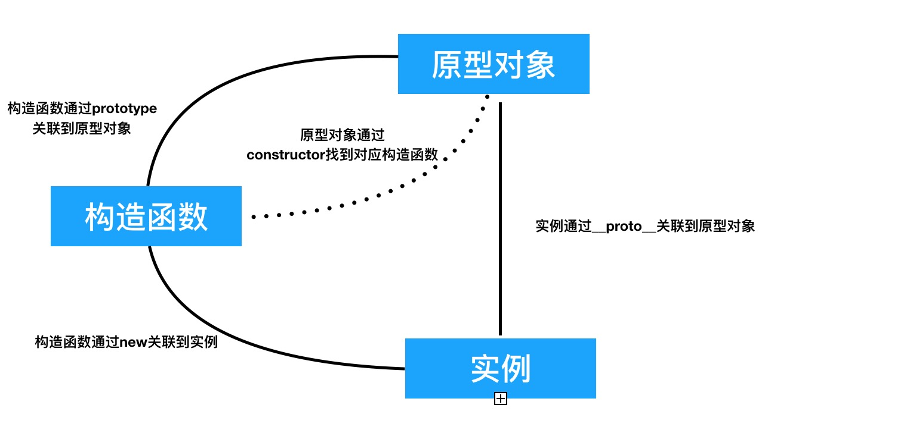
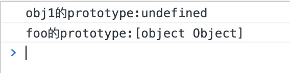
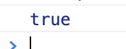
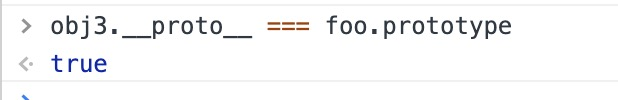
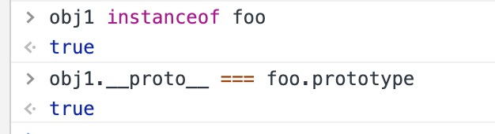
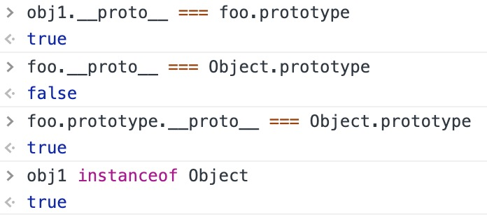

# JavaScript 之原型链

## 前言

在 JavaScript 中 一直感觉原型链是个很绕口或者是个理解起来很费劲的东西 那么 希望通过这篇文章能够对你有所帮助 既然说到原型链 那么第一个问题就是 创建对象 毕竟 如果没有对象 哪里来的原型链呢 是不是 所以 先来看看创建对象的几种方法吧

## 创建对象的几种方法

1. 通过字面常量的方式创建 也可能是我们日常开发中使用的最多的方法

```js
var obj1 = { name: 'obj1' }
```

2. 通过`new Object` 其实这种创建方式等价于字面常量创建

```js
var obj2 = new Object({
  name: 'obj2'
})
```

3. 通过构造函数创建

```js
var foo = function(name) {
  this.name = name
}
var obj3 = new foo('obj3')
```

4. 通过`Object.create`创建

```js
var n = { name: 'obj4' }
var obj4 = Object.create(n)
```

## 原型链之中的关系梳理

在开始下面的长篇大论以前 还是先来看一张图 这张图其实非常好的说明了`实例 原型对象 构造函数`之间的关联关系 其实要是可以看明白这张图 也基本明白啥是原型链以及原型链的工作原理了


- 构造函数和实例: 例如上文的`obj3` 他就是构造函数`foo`new 出来的一个实例 这里多嘴一句 但凡任意函数名前面 有`new`这个关键字 那么这个函数都可以被称之为构造函数 由于这个点非常简单 所以我们就一笔带过吧 相信有 JS 基础的同学 应该都很容易理解

- 构造函数和原型对象: 当我们在写一个函数的时候 不论这个函数的函数体是什么 哪怕一行代码也没有 他就是空有一个`function` JavaScript 的模板引擎也会为这个函数体自动添加一个 prototype 也就是原型对象 也就是图上所说的 构造函数和原型对象通过 prototype 关联 这个地方还有一点非常重要
  <span style="color: red">只有函数才有 prototype 而实例是没有的</span>
  这一点可以用代码来佐证

```js
var obj1 = { name: 'obj1' }
console.log('obj1的prototype:' + obj1.prototype)

var foo = function(name) {
  this.name = name
}
console.log('foo的prototype:' + foo.prototype)
```

我们可以打开浏览器看看控制台都输出了些什么



这样也算是有图有真相了吧 233333

- 原型对象和构造函数: 看到这里 肯定会有人想问 那既然我们写一个函数 就会有一个 prototype 那么这么多的 prototype 又如何区分呢 这里 就要用到`constructor` 也就是说 不论这个函数怎么写 原型对象都会通过`constructor`来找到它 老规矩 还是上代码

```js
var foo = function(name) {
  this.name = name
}
console.log(foo.prototype.constructor === foo)
```

控制台的打印结果如下



所以这个观点也是被代码所佐证了

- 实例和原型对象: 实例和原型对象之间 是通过`__proto__`相关联 这里也有一点同样值得注意
  <span style="color :red">
  函数同样拥有`__proto__` 因为函数既是函数 也同样是实例 他的原型对象就是一个`Function`
  </span>
  同样的 还是来上代码 并观察输出结果

```js
var foo = function(name) {
  this.name = name
}
var obj3 = new foo('obj3')
```



写到这里 其实就已经差不多了 有了理论支持 那么接下去 其实就是得出结论啦

## 原型链的工作原理

既然已经知晓了实例 构造函数 原型对象之间的关系 那么 其实当查找一个实例是否拥有一个属性的时候 JS 的模板引擎会逐级向上寻找 也就是

`实例 -> 构造函数 -> 原型对象 -> 原型对象的原型对象 -> ... -> Object.prototype`

如果这一整个查找过程都没有找到对应的属性那么则会返回`undefined` 如果有则返回对应的属性值 既然也知晓了工作原理 其实就可以在日常工作中通过原型链 去帮助我们写出更加简洁 更加优雅的代码

## 原型链的实际应用

假设我们现在通过相同的构造函数创建了多个实例 而这些实例有时候都会调用相同函数 有些同学可能会每一次都会拷贝一份方法 其实大可不必 我们可以直接将相同代码直接挂载到`prototype`上即可 代码如下

```js
var foo = function(name) {
  this.name = name
}
foo.prototype.sayName = function(name) {
  console.log('我是对象' + this.name)
}
var obj3 = new foo('obj3')
obj3.sayName('obj3')
var obj5 = new foo('obj5')
obj5.sayName('obj5')
```

控制台输出结果如下


## instanceof

`instanceof` 这个应该大家都不陌生 主要还是用于区分某个实例是否是属于一个特定的类 下面来说说`instanceof`的工作原理

其实也非常简单 上文其实有提到过 实例是通过`__proto`来和原型对象关联的 而构造函数呢 又是通过`prototype`来关联原型对象的 所以呢 如果一个实例的`__proto__`和一个构造函数的`prototype`如果是一致的 那么其实是可以暂且说 这个实例是属于某个特定的类的 为什么说是暂且呢 一会儿来分析 先来看看刚才说的这些对不对吧 首先通过构造函数 new 一个 obj 实例 然后在控制台里看看
刚才说的对不对
```js
var foo = function(name) {
  this.name = name
}
var obj = new foo('obj1')
```
看看控制台输出了啥


和我们之前说的一样 构造函数foo的```prototype```和实例obj的```__proto__```属性 是一致的 那么接下来来看一个神奇的问题 ```obj instanceof Object```会返回什么？
答案是 ```true```如果有不相信的同学 其实可以自己去控制台里试试看 一定是返回的true 这是为什么呢  其实也还是脱离不了原型链这个概念

首先 实例obj是构造函数foo new出来的一个对象 但是呢 构造函数foo 其实也是Object下的一个对象 这么一说可能还有点抽象 但是如果结合 ```instanceof```的工作原理的话 其实就不难理解了 其实无外乎也就是一个原型链的查找过程
```js
// 首先
    obj1.__proto__ === foo.prototype // true
// 其次
    foo.prototype.__poto__ === Object.prototype // true
// 最后
    obj1 instanceof Object // true
```


所以这也是为什么说 用instanceof 有时候并不够严谨的原因 那么真正严谨的应该是什么呢 其实答案应该也是呼之欲出了 上文有提到过 每一个构造函数在书写的时候 JavaScript模板引擎就会自动添加一个```prototype``` 而这个```prototype```又是通过```constructor```去判断到底具体是哪个构造函数 所以 用```constructor```其实应该是更为严谨的一种写法
```js
obj1.__proto__.constructor === foo // true
obj1.__proto__.constructor === Object // false
```

### All is well 💯