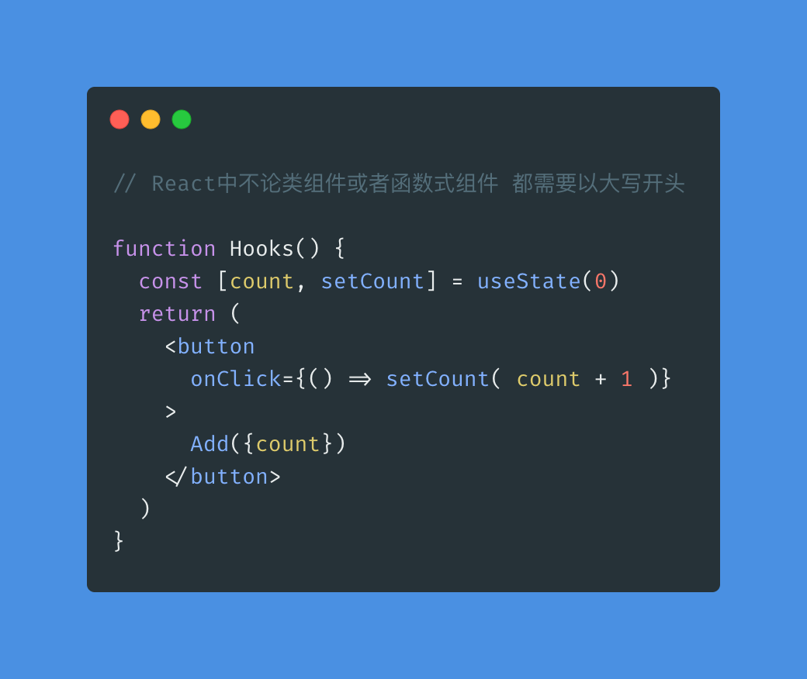

# React16新特性
<!--
 * @Descripttion: 注释
 * @Author: 朱海华
 * @Date: 2020-08-27 14:54:45
 * @LastEditTime: 2020-09-01 22:04:39
-->
## 生命周期
  ### 组件初始化
  * ### Constructor
  1. 用于初始化组建内部状态
  2. 唯一可以直接修改State的地方 (由于是在constructor中 所以可以直接通过 ``` this.state = xxx ``` 直接修改 而不需要通过```setState```)

  * ### getDerivedStateFromProps
  1. 当state需要从props初始化时使用
  2. 尽量不要使用 => <span style="color: red">维护两者状态一致性会增加复杂度</span>
  3. 每次render都会调用
  4. 典型场景: 获取表单控件默认值

  * ### componentDidMount
  1. UI渲染完以后调用
  2. 只执行一次
  3. 场景: 获取外部资源 => 发起ajax请求

  ### 组件卸载
  * ### componentWillUnMount
  1. 组件移除时被调用
  2. 场景: 资源释放 => 清空定时器
  

  ### 组件更新
  * ### getSnapshotBeforeUpdate
  1. 在render之前被调用 此时state已被更新
  2. 场景: 获取render之前的Dom状态

  * ### componentDidUpdate
  1. 每次UI更新时被调用
  2. 场景: 页面根据props变化重新获取数据

  * ### shouldComponentUpdate
  1. 决定虚拟dom是否要重绘
  2. 一般可以由```PureComponent```自动实现
  3. 场景: 性能优化

## Virtual Dom以及key
  * ### 广度优先分层比较
    1. 从根结点开始比较
    2. 如果是属性变化或者是顺序变化 => 通过组件标识 然后交换节点位置
    3. 如果组件类型发生变化 => 直接删除的原有节点并替换
    4. 节点跨层移动 => 删除原有的节点 在新层级下append节点 (性能比较低)

## Context Api <span style="color: red; font-size: 16px">切勿滥用</span>
  * 定义
    * 提供了一种方式 能够让数据在组件树中传递 而不需要一层一层的向下props
    * 类似```vue```中的```provide/inject```
  * 创建
    * ```React.createContent(val)```
    * ```val``` 如果```Consumer```找不到对应的```Provider``` 那么就会使用传入的val
    * 需要创建一个```Provider```和一个```Consumer```
    * 示例代码
      

## PureComponent和memo
  * 两者都可以避免组件的重复渲染 减少性能开销
  * 前者为类组件使用 后者为函数式组件使用

## Hooks
  * 定义
    * 在函数组件中使用特定的预定义函数来标记状态和组件生命周期 使得所有组件都可以使用函数来编写
    
  * 优化了类组件的三大问题
    1. 函数组件无```this```指向问题
    2. 自定义hook方便复用逻辑
    3. 副作用的关注点分离 => 副作用指视图修改以外的所有事件 例如: ajax请求 本地持久化缓存 绑定事件等

  * 使用
    :::tip
      可以通过```eslint-react-hooks```这个插件防止书写```hooks```过程中的一些代码顺序错误以及调用次数错误
      配置参考: [eslint-react-hooks](http://react.html.cn/docs/hooks-rules.html)
    :::
    1. 所有的hooks函数都需要以```use```开头 例如:```useState``` 基础使用方式如下
    
    2. 上述代码中 ```useState```是如何知道需要更新的count就是该组件的而不是其他组件的呢?
        * 因为js是单线程的 在同一情况下 只会有一个组件的上下文存在 所以在useState可以知道
    3. 多个```useState```是如何返回的？
        * 根据<span style="color: red">第一次运行state的顺序</span> 自上而下逐一返回 一定要确保代码顺序是一致的
    4. ```useState```可以传入一个函数 来执行延迟初始化提高效率
        ```js
          const [count, setCount] = useState(() => {
            return 0
          })
        ```
    5. 如果```useState```传入相同的值 页面是不会重复渲染的