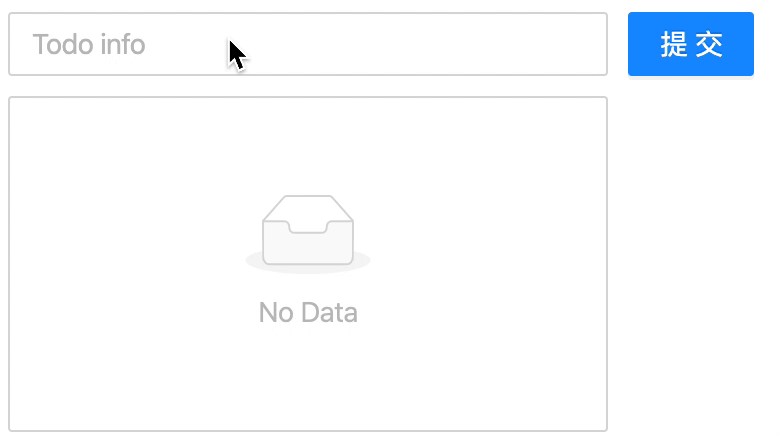

# Redux工作流解析
## Redux是什么
  假设我们的业务有三个嵌套的组件ABC 组件A想要传值给组件C 要先传递给组件B 交由B传递给C 在没有引入```Redux```的时候 我们只能通过这种原始的方法来传递 这时候 我们再假设 如果有一个 公共管理数据状态的地方 我们每次传递值或者修改值 都从这个地方获取 那不论业务多复杂 组件嵌套多深 我们都可以很方便的直接从这个管理仓库里 获取到我们需要的数据 这就是```Redux```  一个 ```数据层```的框架 或者说是一个 ```状态容器```

## 了解Redux工作流


这张图非常清晰的描述了 ```Redux```的工作流程 光看这一张图可能会有一点晦涩难懂 但是我们可以换个说法 把整个工作流程想像成一个借书的过程 

一个人来图书馆借书 他需要说一句话告诉管理员 要借什么书 管理员要根据他提供的信息 找到对应的书籍 然后拿给他 想象过这个过程以后 再来看这个过程 

首先 ```React Component```这个组件就是需要借书的人 同时```Store```就是这个图书馆的管理员 他需要告诉管理员 他要借什么书 那么这个```Action Creators```就是记录这个信息 并且告知管理员 同时管理员接收到这个信息以后 他需要查询管理手册 找到对应书籍 这个手册就对应```Reducers```

对应到实际开发到业务逻辑里 其实就是 ```View``` 创建了一个```action``` 通过```dispatch```派发到```Store``` 然后```Store```会自动转发到```Reducers``` 那么Reduces就可以接收到这个action 同时根据action来处理业务逻辑 并返回给```Store``` 那么接下来一起来看代码是如何实现的吧

## 使用Redux完成TodoList
  ::: tip
  由于讲述的是Redux 所以掠过了基础的React组件部分
  :::

  

  * 安装Redux ```npm install redux --save```
  * 再一次回想流程 我们需要一个Store(图书馆管理员) 在src目录下新建一个Store文件夹 并创建```index.js```生成```Store``` 接收一个```reducer```参数(对应图书馆管理员的管理手册) 有了手册才可以找到对应书籍对吧～

    ```js
    // store.js
    import { createStore } from 'redux'
    import reducer from './reducer.js'
    const Store = creaeStore(reducer)
    ```

  * 上面已经提到了我们需要一个```reducer``` 所以 我们新建一个```reducer.js``` 同时需要注意的是```reducer.js```是一个纯函数 上文已经提到过 这个文件是一个管理手册 也就说 存放了书籍的具体信息```(需要被管理的数据)```以及如何处理书籍```(业务逻辑)```
  *  reducer可以接收两个参数 一个是```action``` 一个是```state``` 默认情况下 同时可以定义一组需要被统一管理的数据 把这个需要被管理的数据赋值给state 至于```action```我们一会儿再聊

  ```js
  // reducer.js
  const originData = {
    inputValue: '',
    list: []
  }
  export default const reducer = (state = originData, action) => {
    return state
  }
  ```
  
  * 在组件内部引入```Store``` 同时store提供了```getState()```这个API 可以让我们获取定义好的state 既然获取了数据 那么如果修改了数据 我们也是需要让组件知道的 所以需要使用store提供给我们的另一个API ```subscribe``` 这里定义的```handleStoreChange```其实只做一件事 也就是再次重新获取state

  ```js
  // 获取store里的数据
  import store from './Store/'
    constructor() {
      // 获取数据 
      this.state = store.getState()
      // 组件订阅store
      store.subscribe(this.handleStoreChange) 
    }
    handleStoreChange() {
      this.setState(store.getState())
    }
  ```

  * 执行到上面那一步我们就可以在我们的业务组件中使用```redux```了 在对应业务组件中引入这个```Store``` 同时我们再次回顾上问中的Redux工作流的那张图 当有了管理员```(store)``` 并且有了管理手册以后```(reducer)```以后 我们现在只差一步了 也就是告诉管理员 我们需要借什么书```(操作什么数据)``` 也就是组件向```Store```派发一个```action```的过程
  ```js
  // 组件派发action

  // 组件对应的绑定事件
  handleValueChange(e) {
    // 创建一个action type表示要做啥 value 表示需要传递的值
     const action = {
      type: 'change_input_value',
      value: e.target.value
    }
    store.dispatch(action) //store接收到事件以后 需要转发给reducers 交由reducers处理
  }
  ```

  * 当代码写到这里 回头再去看一次上文提到的比喻 看看发生了什么 首先 借书人```view/React Component```通过一句话```action```告诉了管理员```Store```要借什么书 这个时候 管理员需要查阅手册 来返回对应的书```newState``` 所以我们回到reducer里看看 该怎么实现需求

    * 还记得之前定义```reducer.js```的时候 reducer函数接收的参数里有```action```么 这个```action```其实就是```store```自动转发给```reducer```的 所以我们可以在```reducer```里拿到对应的```action``` 并且根据action定义的type不同 处理不同的业务逻辑
    
    * 同时我们还需要注意一点 在Redux之中 真正可以修改的数据的 其实只有Store 并不是修改的方法写在reducer里 reducer就可以修改数据 所以我们需要一个返回一个新值给到Store
  ```js
  const originData = {
    inputValue: '',
    list: []
  }
  //reducer.js
  export default (state = originData, action) => {
  if (action.type === 'change_input_value') {
    // 返回一个新的state
    const newState = JSON.parse(JSON.stringify(state))
    newState.inputValue = action.value
    return newState  // store会接收到这个newState 并且会把原有数据替换成该数据 真正有权修改数据的还是Store本身
  }
  return state
  ```
  * 写到这里 其实我们就完成了redux的初步使用 以及完整的讲解了redux的工作流程 完成了TodoList的第一个功能 顺利输入内容 
  
  * TodoList里剩下的两个功能就是 点击添加的时候 展示区域显示输入的值 以及在展示区域点击对应项 则可以删除对应项 其实也就是继续在组件内的对应函数里创建不同的action 并且在reducer里对对应的action进行处理即可

  * 待优化的点 可以创建```action creators``` 统一管理action的创建 以及 ```actionTypes```的定义 减少因为定义type时发生的拼写错误

  ## 加油 💯