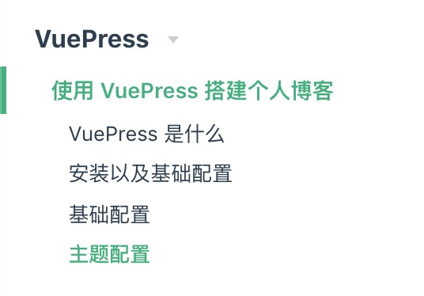

# 使用 VuePress 搭建个人博客

## VuePress 是什么

VuePress 诞生的初衷是为了支持 Vue 以及其项目的文档需求 同时它由两部分组成 一个是基于 Vue 开发的静态网站生成器 另一部分则是提供了书写技术文档而优化的默认主题 看起来感觉很复杂 但是其实 总之就是一句话 可以通过 VuePres 快速生成一个属于自己的个人博客 同时依赖`Git Pages` 可以直接将自己的博客部署到 GitHub 上

## 安装以及基础配置

::: warning 开始之前请检查 node 版本
`node -v`
确保 node 版本 >= 8
:::
检查完 node 版本以后 可以通过全局/项目安装的方式 安装 VuePress 我采用的是全局 npm 安装
`npm install -g vuepress`
安装完成以后 需要新建一个`package.json` 该文件的目的在于 使用一些脚本命令 让 webpack 帮助我们打包项目

```json
{
  "scripts": {
    // 运行项目
    "docs:dev": "vuepress dev docs",
    // 打包构建项目 => 部署时用到
    "docs:build": "vuepress build docs"
  }
}
```

其实到这里 就已经可以开始通过 VuePress 进行文档类的写作了 但是对于要构建个人博客的我们来说 其实应该是远远不够的 所以下面来说一下具体的一些配置项 通过这些配置项让我们可以快速构建出一个博客原型

## 基础配置

我们需要在 docs 文件夹下新建一个.vuepress 目录 这个目录里存放一个`config.js` 这个 js 文件包含的 js 对象就是对 VuePress 的一些配置 同时也需要新建一个`public`文件夹 这个文件夹用于存放一些静态资源 例如图片之类的 所以 当都完成了上述的步骤之后 你的目录结构有可能是这样的

```
.
|-- docs
|   |-- .vuepress
|   |   |-- config.js   // 存放配置项
    |   |-- public     // 存放静态资源文件
|-- README.md   // 配置首页
|-- package.json   // 脚本命令
```

好了 上述文件中 其实还有一个 README.md 这个`.md`文件其实就是用来配置你的博客首页的 具体的配置项如下 这个文件的配置方法是通过`YAML`进行配置

```YAML
---
home: true
heroImage: /image/avatar.jpeg  // 头像
actionText: 博客 →  // 链接按钮text
actionLink: /Vue/ // 按钮点击跳转以后的页面
footer: 做人嘛 最重要的就是开心啦
---
```

同时需要在 config.js 里做如下配置

```js
module.exports = {
  title: '前端打杂师 - Zhu',
  description: 'All is well'
}
```

当这样配置完成以后 当你运行项目的时候 应该可以看见类似下图的主页内容


## 主题配置
*  导航栏配置
```js
themeConfig: {
    nav: [
      { text: '首页', 
        link: '/' 
      },
      { text: '博客', 
        link: '/vue/',
      },
      { text: 'GitHub', link: 'https://github.com/ThecoadeR/vue-press/'}
    ]
}
```
需要注意的是 这个地方 如果是```link```到博客中的具体文章的话 其实```link```写的就是对应的路径 而如果是```link```到外部链接的话 不要忘记加网址对应的http协议

* 侧边栏配置
侧边栏可以在```config.js```里通过```sidebar```这个对象进行具体的配置
如果仅仅是希望生成一个包含页面标题的侧边栏 那只需要做如下配置
```js
module.exports = {
  themeConfig: {
    sidebar: 'auto'
  }
}
```
这样VuePress会自动寻找到对应的标题(例如```h1 h2 h3```标签) 并且渲染在侧边栏上

但是往往有时候 我们需要更复杂的侧边栏 例如下图



这样的侧边栏 我个人认为更适合 也就是包含了具体的分类 同时分类下包含了文章标题并且可以折叠 如果想实现这样的侧边栏配置 那么则需要将每一个侧边栏都当做一个对象 写入```themeConfig```
```js
sidebar: [
      {
        title: 'VuePress',
        collapsable: true, // 是否折叠
        children: [  // 具体文章内容的路径
          '/VuePress/'
        ]
      }
]
```
值得一提的是 光是这样是无法渲染侧边栏的 同时你需要确保你的目录结构如下图


```
.
|-- docs
|   |-- .vuepress
|   |   |-- config.js   // 存放配置项
    |   |-- public     // 存放静态资源文件
|-- README.md   // 配置首页
|-- package.json   // 脚本命令
|-- VuePress // 文件
|   |-- README.md // 对应.md文件
```

## 部署
当首页 侧边栏 以及具体的文章都实现了以后 那么剩下的就是部署了 其中VuePress官方文档也提供了非常多的部署方案 由于我使用的是部署到GitHub 所以本篇文章只讲述如何部署到```github.page```

* 开始之前
::: warning 文件路径
细心的同学可能会发现 在```deploy.sh```文件里有这么一行代码 ```cd cd docs/.vuepress/dist``` 也就是说 如果想要脚本文件执行顺利 你需要确保你打包以后的dist文件夹是在.vuepress下  所以如果在```config.js```里设置了 ```dest```的同学 注意修改```deploy.sh```下的路径
:::
* 首先在项目里新建脚本文件 deploy.sh 并写入如下脚本
``` sh
#!/usr/bin/env sh

# 确保脚本抛出遇到的错误
set -e

# 生成静态文件
npm run docs:build

# 进入生成的文件夹
cd docs/.vuepress/dist

# 如果是发布到自定义域名
# echo 'www.example.com' > CNAME

git init
git add -A
git commit -m 'deploy'

# 如果发布到 https://<USERNAME>.github.io
# git push -f git@github.com:<USERNAME>/<USERNAME>.github.io.git master

# 如果发布到 https://<USERNAME>.github.io/<REPO>
# git push -f git@github.com:<USERNAME>/<REPO>.git master:gh-pages

cd -
```
* 选择部署到github的对应方式 并解开对应注释
这里需要注意的是 如果选择的是第二种方式的话 需要在config.js里配置一下具体的```<repo>```做如下配置即可
```js
module.exports = {
  base: "/vue-press/",
}
```
* 新建scripts命令 简化部署流程
在```package.json```里做如下配置
```json
{
  "scripts": {
    "docs:dev": "vuepress dev docs",
    "docs:build": "vuepress build docs",
    "deploy": "bash deploy.sh"
  }
}
```
这样每次需要更新文章 只需要在终端里输入 ```npm run deploy```即可

## 最后
##### VuePress真香 😂🤣😂🤣
